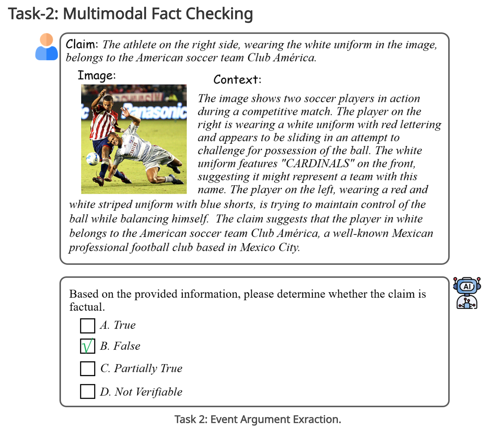

# Responsible AI challenge @ ACMMM 25 Task-2: Multimodal Fact Checking

## Task 2: Multimodal Fact Checking


This task focuses on verifying the factual accuracy of claims by analyzing multimodal inputs. Participants are given:
• A claim in textual form, which can be a news headline, a sentence from an article, or a social media post.
• An accompanying image related to the claim.
• Additional context in textual form, such as the full text of the news article, a related social media discussion, or other supplementary information.
Participants must determine the factual accuracy of the claim based on all the provided inputs. They need to assign one of four possible labels to the claim: "True", "False", "Partially True", and "Not Verifiable". This task is treated as a four-class classification problem, requiring participants to consider both the visual and textual evidence to assess the claim’s factuality comprehensively.

For this task, we will provide a dataset with a train set ，a dev set and a test set. The annotations are in the form of a JSON file. An example of the task metadata is shown below.

```json
"metadata": {
    "image_id": "0234613.jpg",
    "claim": "Corbin Aoyagi a supporter of gay marriage waves a rainbow flag during a rally at the Utah State Capitol on Jan 28",
    "context": "The attorneys general of Virginia and Utah are bringing their state same-sex marriage bans to the Supreme Court. Utah Attorney General Sean Reyes filed a petition with the court, seeking a review of the ruling that struck down Utah's ban on same-sex marriage. Virginia Attorney General Mark Herring plans to do the same, arguing the ban is discriminatory. There is a push for a swift resolution due to the numerous legal victories for same-sex marriage advocates following last summer's Supreme Court decision. Utah's petition questions if the 14th Amendment prevents states from defining marriage as only between a man and a woman. Reyes emphasizes his duty to defend the state's constitution. Herring supports a quick final resolution to affirm marriage rights for all Virginians.",
    "question": "Based on the provided information, please determine whether the claim is factual.",
    "correct_answer": "True",
    "correct_choice": "A",
    "choices": [
        {
            "id": "A",
            "choice": "True"
        },
        {
            "id": "B",
            "choice": "False"
        },
        {
            "id": "C",
            "choice": "Partially True"
        },
        {
            "id": "D",
            "choice": "Not Verifiable"
        }
    ]
}
```

## Evaluation

The F1 score is computed using precision (P) and recall (R), which are calculated as follows:

`P = TP / ( TP + FP )`

`R = TP / ( TP + FN )`

`F1 = 2 * P * R / ( P + R )`

where TP, FP, and FN represent specific items that are used to calculate the F1 score in the context of a Confusion_matrix. In particular, when computing the micro-F1 score, TP corresponds to the number of predicted tuple that match exactly with those in the gold set.

## Dataset

We will utilize synthetic and real-world multimodal datasets for these tasks, including balanced distributions of various scenarios. Table I and Table II are the dataset statistics. The datasets include diverse scenarios such as indoor, outdoor, social, and news contexts to ensure robust evaluation.

| Field                  | Train  | Dev   | Test  |
|------------------------|--------|-------|-------|
| Number of claims       | 2800   | 200   | 1000  |
| Average context length | 120 words | 115 words | 122 words |
| Number of images       | 2800   | 200   | 1000  |
| Factuality labels      | 4      | 4     | 4     |
| Scene categories       | 16     | 16    | 16    |


## Timeline

- Registration Opens: `March 20, 2025`
- Training Data Release: `March 30, 2025`
- Challenge Result Submission Deadline:	`May 20, 2025`
- Leaderboard Release: `June 1, 2025`
- Challenge Paper Submission Deadline: `June 15, 2025`